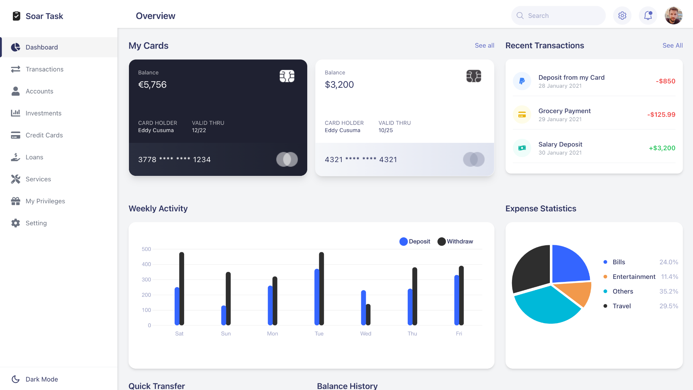
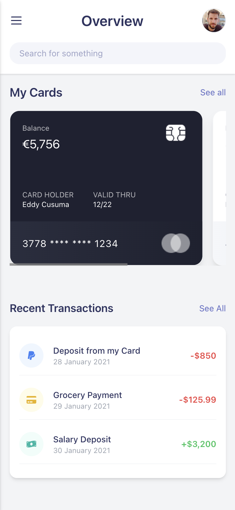

# Soar Task — Personal Finance Dashboard

A modern, fully responsive financial dashboard built with React and Tailwind CSS. Designed for simplicity, clarity, and performance with a clean UX and visual theming support.

🔗 **Live Site**: [https://soar-project.vercel.app/dashboard](https://soar-project.vercel.app/dashboard)

---

## Dashboard & Mobile Screenshot
  

---

## 🌟 Features

- 🧑‍💼 **User Profile & Preferences**: Update personal information, theme, and security credentials.
- 💳 **Credit Card Management**: View existing cards or apply for new ones.
- 💰 **Transactions Table**: Detailed breakdown of all transactions by type and date.
- 📊 **Dashboard Insights**:
  - Weekly activity graph
  - Expense statistics (pie chart)
  - Recent transactions
  - Balance history
- 🌚 **Dark Mode** toggle (sun/moon icon in sidebar)
- 📱 Fully responsive layout across devices
- 🔄 Simulated backend using `mockBackend.js`
- ⚙️ Global state powered by Zustand

---

## 🚀 Getting Started

### 1. Clone the Repo

```bash
git clone https://github.com/yourusername/soar-task.git
cd soar-task
```

### 2. Install Dependencies

```bash
yarn
```

### 3. Start Development Server

```bash
yarn start 
```

---

## 🗂 Folder Structure

```
├── public/
├── src/
│   ├── assets/              # Logos, icons, and image assets
│   ├── components/          # Reusable UI components
│   ├── layout/              # Layout wrapper (Topbar + Sidebar)
│   ├── pages/               # Route-based screens
│   ├── services/            # mockBackend.js + api.js (API abstraction)
│   ├── store/               # Zustand store and state logic
│   └── App.jsx              # Routes and main entry
```

---

## 📌 Assumptions Made

- 🔐 Authentication is not implemented, but the app is designed with expandability in mind.
- 🌓 A **Dark Mode** toggle was added (not originally required).
- 🧩 Additional pages like **Accounts**, **Credit Cards**, **Transactions**, **Preferences**, and **Security** were added to match a typical financial dashboard structure.
- 📬 All user/card/transaction/account data is stored and retrieved via a **mock backend**, simulating real API behavior.
- 💳 New card form auto-generates card number, expiry, and links the card to an account.
- 📦 All forms include **basic validation** and feedback.
- 💾 State is managed via **Zustand**, with async logic supported for future backend expansion.
- ⚙️ SVG icons are imported as React components from exported Figma assets.

---

## 🔄 Future Enhancements

- ✅ Authentication & Authorization
- 🛠 Admin dashboard or API for managing cards, accounts
- 📤 Cloud persistence (Supabase, Firebase, or REST API)
- 🌍 i18n support
- ✅ Unit & integration testing

---

## 📄 License

MIT License © 2024

---

## 👨‍💻 Built By

**Xarri Jorge**  [GitHub](https://github.com/xarrijorge) •• [Live Demo](https://soar-project.vercel.app/dashboard)